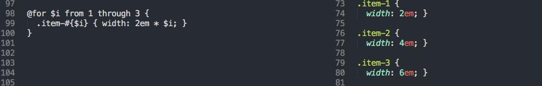

# sass - 学习笔记

sass 是基于ruby开发出来的成熟、稳定、强大的 CSS 扩展语言。

# sass 语法  

sass有两种语法：1. 类ruby的语法: `.sass`；2. css3 超集的语法: `.scss`   
  

# sass 的安装  

sass 是基于ruby开发的，所以使用之前请先确认你的环境中是否已经安装了ruby，关于ruby的安装可以查看ruby官方网站：https://www.ruby-lang.org 
> 这里说几点关于ruby的小知识：
> rvm - ruby的版本管理工具
> > 官网给出的说明：RVM is a command-line tool which allows you to easily install, manage, and work with multiple ruby environments from interpreters to sets of gems.（rvm是一个便于安装，管理和切换多个ruby环境的命令行工具）  

> gem - ruby的包管理工具（相当于node上的npm）
> > 可以通过：gem install sass 来安装sass
> > 更多信息使用：gem -h 来学习   

sass的安装使用命令：`$ gem install sass`   
使用命令 `sass -h` 查看sass命令更多用法   

# compass  
  - Compass is an open-source CSS Authoring Framework.   
  - compass是一个开源的css书写框架, compass 实在sass基础上二次开发的一个css框架     
  * 官网：http://compass-style.org   
  * compass 安装：`$ gem install compass` 或者 `$sudo gem install compass`   
  * 使用 `compass -h` 学习compass命令用法   
  
# sass-convert  

上面已经指明：在sass中存在两种语法格式：类ruby 和 类CSS3 。这两者之间并没有什么优略，选择合适自己的就是最好的。   

那么两种格式如何转换？难道要手动转？哈哈！那不要累死人了！   

sass提供了一个命令：`sass-convert` 来帮助我们自动转换这两种风格的语法，sass-convert的使用很简单：

```bash

$ sass-convert demo_01.scss demo_01.sass   // scss -> sass  
$ sass-convert demo_02.cass demo_02.scss   // sass -> scss   

```   

```sass
// demo_01.scss
body {
    background: red;
    width: 980px;
    margin: 0 auto;
}
// demo_02.sass
body
  background: red
  width: 980px
  margin: 0 auto

```

# sass 中注释
sass中添加注释和大多数语言一样：`//` - 行注释；`/*   */`块注释. 不同的是，行注释不会编译到css文件中，块注释则会添加在生成的css文件中


# sass 变量声明
* sass中变量声明有点类似php使用 `$`  

* 如果变量需要镶嵌在字符串之中，就必须需要写在#{}之中
```sass
$side : left;
.rounded {
　　border-#{$side}-radius: 5px;
}
```

* 全局定义：!global ,这样你就可以在任何地方定义变量，在任何地方使用变量    
   

# sass 文件引入 

文件引入和css中类似：`@import "xxx"` ， 但是sass对import进行了升级，解决了一下问题


默认生成文件中的 `@import "compass/reset";` 作用是：去掉浏览器默认的一些样式行为，因为有些浏览器默认的样式并不统一。

** 那如何引入css文件 **  


# sass 文件名 

* sass规定：以下划线开头文件名的文件是局部文件，这些.scss文件前面都有一个下划线(_)，用来告诉Sass，这些.scss文件只是局部，不通过@import 是不应该被编译出.css文件。事实上，它们是导入和合并文件的基本文件而以。
* 在没有文件名后缀时，sass会自动添加 .scss 或者 .sass 的后缀       
* 同一目录下，局部文件和非局部文件是不能同名的   

# sass 嵌套语法


# sass 父类选择器 & 

请仔细查看下面三个不同之处   
  

在没有父类选择器时（第一个），编译后的css，会作用于a标签下所有 `:hover` 的效果，有了父类选择器，就只会作用于a标签（第二个）；第三个意思是：如果你有一个深层嵌套的规则，父选择符也会在 & 被替换之前被完整的解析    

# sass 嵌套属性  

sass不光提供了类的嵌套，还提供了属性的嵌套,注意属性的嵌套使用 `:` 的形式，例如下面 `font:{}`
   


# sass 以命令行交互形式

sass 提供了一个简单的命令行交互形式来运行sass语法： 

```bash

$ sass -i
>> 

```

更多关于sass用法参见`sass -h`   

# sass 数据类型

* 数字（例如 1.2、13、10px）  
* 文本字符串，无论是否有引号（例如 "foo"、'bar'、baz）   
* 颜色（例如 blue、#04a3f9、rgba(255, 0, 0, 0.5)）    
* 布尔值（例如 true、false）    
* 空值（例如 null）    
* 值列表，用空格或逗号分隔（例如 1.5em 1em 0 2em、Helvetica, Arial, sans-serif）    

SassScript 还支持所有其他 CSS 属性值类型， 例如 Unicode 范围和 !important 声明。 然而，它不会对这些类型做特殊处理。 它们只会被当做不带引号的字符串看待。

# sass 运算符

等式运算（`==` 和 `!=`）: 所有数据类型支持    
数字运算 (加 `+`、减 `-`、乘 `*`、除 `/`和取模 `%`): 数据类型支持，数字也支持关系运算（`<`、`>`、`<=`、`>=`); 注意 除法 `/` 有特殊用法：  

> 除法运算和 /

> CSS 允许 / 出现在属性值里，作为分隔数字的一种方法。 既然 SassScript 是 CSS 属性语法的扩展， 他就必须支持这种语法，同时也允许 / 用在除法运算上。 也就是说，默认情况下，在 SassScript 里用 / 分隔的两个数字， 都会在 CSS 中原封不动的输出。

> 然而，在以下三种情况中，/ 会被解释为除法运算。 这就覆盖了绝大多数真正使用除法运算的情况。 这些情况是：

> 如果数值或它的任意部分是存储在一个变量中或是函数的返回值。
如果数值被圆括号包围。
如果数值是另一个数学表达式的一部分。

布尔运算：支持布尔值做 and、or 和 not 运算

# sass 中的（）

同其他语言一样，圆括号可以用来改变运算顺序


# sass 在选择器和属性中使用变量：#{} 
  
```sass 

$name: foo;
$attr: border;
p.#{$name} {
  #{$attr}-color: blue;
}

p {
  $font-size: 12px;
  $line-height: 30px;
  font: #{$font-size}/#{$line-height};
}

```

# sass 函数 

* 内置函数  
    ```sass
    hsl($hue, $saturation, $lightness)    
    rgb($red, $green, $blue)
    opacify($color, $amount) / fade-in($color, $amount)
    ```
    更多内置函数请参见：[Module: Sass::Script::Functions](http://sass-lang.com/documentation/Sass/Script/Functions.html)

* mixin 可重用的代码块    
    定义一个Mixin：`@mixin`
    ```sass
    @mixin large-text {
      font: {
        family: Arial;
        size: 20px;
        weight: bold;
      }
      color: #ff0000;
    }
    ```
    
    通过`@include`引入`mixin`  
    ```sass
    .page-title {
      @include large-text;
      padding: 4px;
      margin-top: 10px;
    }
    ```

# 变量默认值： !default

在变量尚未赋值前，通过在值的末尾处添加 !default 标记来为其指定。 也就是说，如果该变量已经被赋值， 就不会再次赋值， 但是，如果还没有被赋值，就会被指定一个值。


# sass 控制命令 

* @if   

  
    
* @for



* @each


* @while


_____

# 总结  

关于sass的学习就暂时总结这么多，更多，更深刻的用法还需要在实践中多多学习


